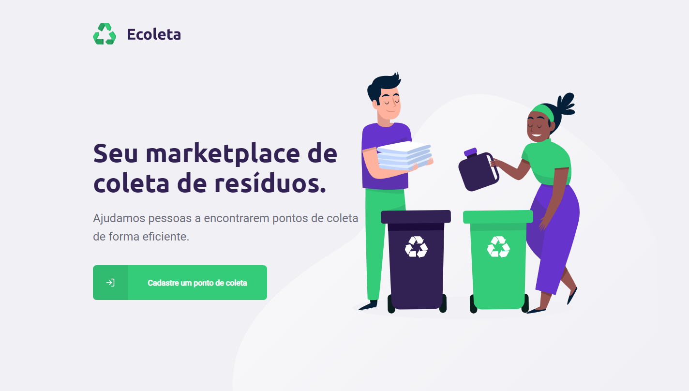
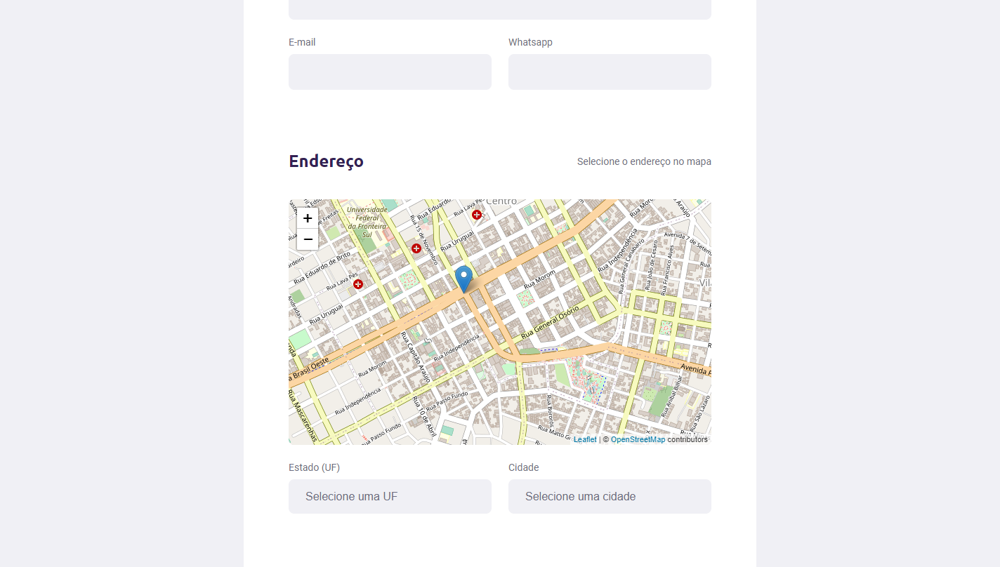
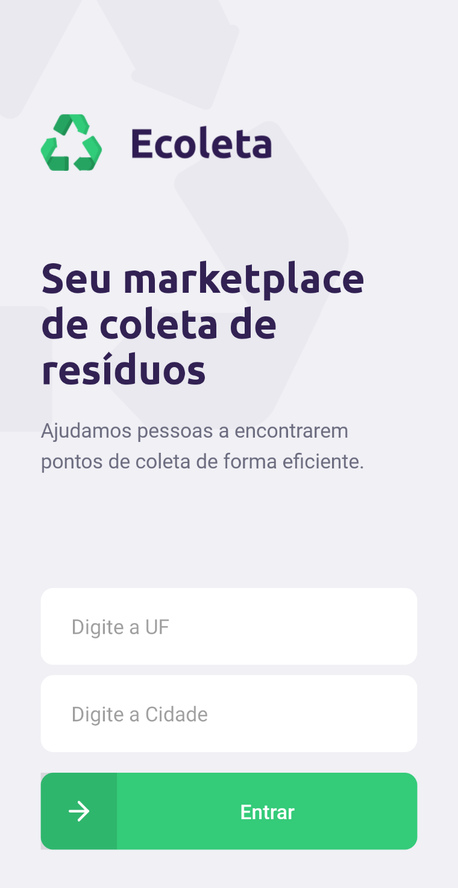
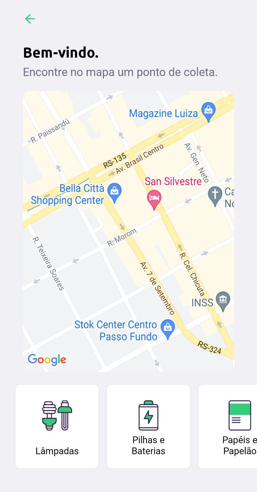
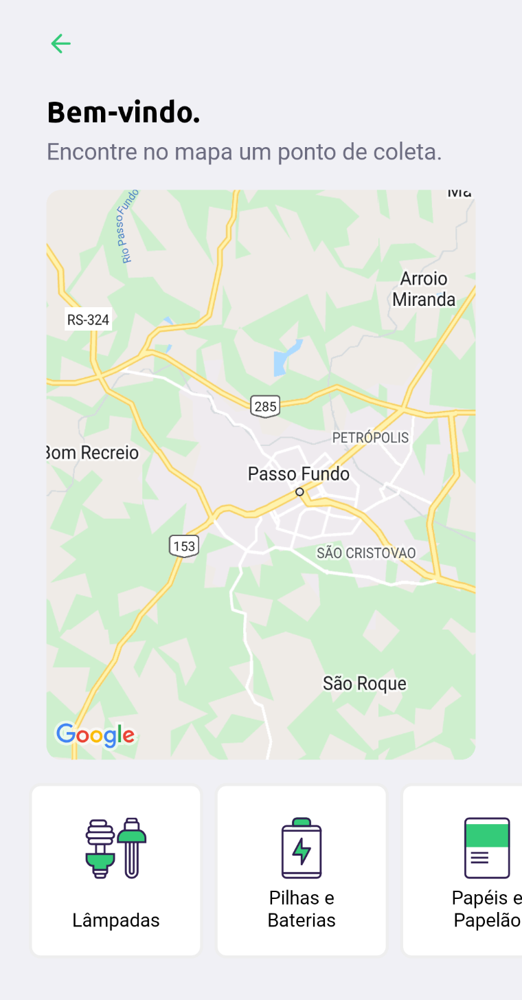

<h1 align="center">
  
</h1>

<h4 align="center"> 
	Next Level Week #01 - Ecoleta
</h4>

  
  
  
  
  
  

* [Índice](#índice)
* [Sobre](#sobre-o-projeto)
  * [Conceito do projeto](#conceito-do-projeto)
  * [Tecnologias](#principais-tecnologias-utilizadas)
* [Licença](#licença)

## Sobre o projeto

O projeto foi desenvolvido durante a primeira edição do evento Next Level Week proporcionado pela empresa [Rocketseat](https://rocketseat.com.br/). Baseou-se em um layout elaborado no Figma.

O sistema, desenvolvido em TypeScript, é composto de um servidor HTTP Node, um [site](https://ecoleta.marcel099.vercel.app/) em React e um aplicativo móvel em React Native.

A opção por essas ferramentas foi realizada pela Rocketseat por acreditarem formar um conjunto de tecnologias poderoso ao permitir desenvolver desde o Back-End até o aplicativo móvel em uma só linguagem: o JavaScript. A escolha por TypeScript, um superset do JavaScript, foi realizada por acreditar trazer um aumento de confiabilidade de código.

### Conceito do projeto

O Ecoleta é um sistema de marketplace que busca auxiliar as pessoas a encontrar pontos de coleta de resíduos próximos delas ou em uma cidade desejada.

Na sua versão web, o usuário pode cadastrar um ponto de coleta, definir quais tipos de resíduos são aceitos e definir a localização da instituição através de uma seleção no mapa.

  

Já na versão para celulares, o usuário pode pesquisar os pontos de coleta de uma cidade e visualizar a localização deles no mapa, podendo selecionar um deles para ver informações detalhadas. O usuário pode, também, filtrar as instituições pelos tipos de resíduos que a instituição aceita.

  
  
  

### Principais tecnologias utilizadas

O sistema foi desenvolvido em TypeScript. É composto de 3 partes:

- Back-End
  - [Node.js](https://nodejs.org/en/)
  - [Express](https://expressjs.com/)
  - [Knex](https://knexjs.org/)
  - [PostgreSQL](https://www.postgresql.org/)
- Front-End Web
  - [Create React App](https://create-react-app.dev/)
  - [React](https://react.dev/)
  - [React Router](https://reactrouter.com/)
  - [React Leaflet](https://react-leaflet.js.org/)
- Front-End Mobile
  - [React Native](https://reactnative.dev/)
  - [Expo](https://expo.dev/)
  - [React Navigation](https://reactnavigation.org/) - [Stack](https://reactnavigation.org/docs/stack-navigator/)
  - [React Native Maps](https://www.npmjs.com/package/react-native-maps)
  - [Expo Location](https://docs.expo.dev/versions/latest/sdk/location)

O maior diferencial desse projeto é o uso de bibliotecas de mapas.

Se desejar explorar as rotas do servidor HTTP Node desenvolvido para esse sistema, poderá fazer isso através do [Insomnia](https://insomnia.rest/).

## Licença
Este projeto está sob a licença MIT. Para maiores detalhes acesse o <a href="./LICENSE.md">arquivo de licença</a>.